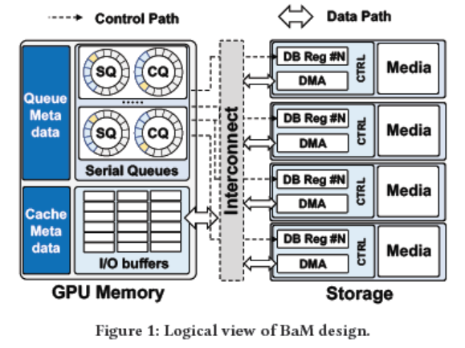
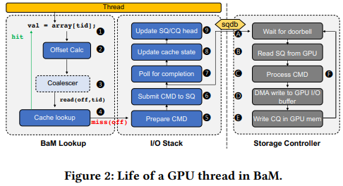
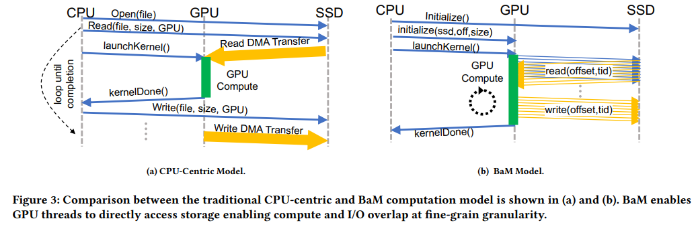

# BaM: GPU-Initiated High-Throughput Storage Access

Paper link: https://arxiv.org/pdf/2203.04910

## ❗ The Problem: CPUs Are Choking GPU Performance
Modern GPUs are computational beasts, capable of massive thread-level parallelism. But there's a catch: they need to be fed—and the datasets in today’s workloads are too large to fit in GPU memory. This creates a critical bottleneck: how do we get massive datasets from storage to the GPU, efficiently and at scale?
This creates a critical bottleneck: how do we get massive datasets from storage to the GPU, efficiently and at scale?
**Traditional Answer: Let the CPU Orchestrate It**
Historically, GPUs rely on CPUs to:
- Preload data chunks (proactive tiling),
- Or respond to page faults via unified memory (reactive fetches).

Both approaches fall apart under data-dependent access patterns typical of:
- Graph analytics
- Recommender systems
- GNNs
- Data analytics pipelines

Why? Because:
- The CPU can't predict what the GPU will need.
- Tiling leads to I/O amplification—fetching way more data than necessary.
- Page faults introduce latency and overhead, with CPUs maxing out at ~500K IOPS, far below the millions that NVMe SSDs can handle.

**Analogy:**
It’s like having a racecar (the GPU) but refueling it with a teaspoon (the CPU).

**Net Result:**
- Underutilized storage hardware (PCIe Gen4 links, SSDs).
- CPU-GPU synchronization overhead.
- Stalled GPU kernels.
- Wasted bandwidth and energy.

**This is the status quo. The paper “GPU-Initiated On-Demand High-Throughput Storage Access in the BaM System Architecture” challenges that by asking:**
What if the GPU could fetch its own data—directly, on demand, at full speed?.

💡 The BaM Solution: Bringing Storage Closer to the GPU
That’s precisely the bottleneck BaM — short for Big Accelerator Memory — is designed to fix.

At its core, BaM isn’t just a faster API or a minor optimization. It’s a new tier in the GPU’s memory hierarchy, one that directly leverages NVMe storage as a semi-integrated extension of GPU memory.

## 💡 The BaM Solution: Bringing Storage Closer to the GPU
That’s precisely the bottleneck BaM — short for Big Accelerator Memory — is designed to fix.
At its core, BaM isn’t just a faster API or a minor optimization. It’s a new tier in the GPU’s memory hierarchy, one that directly leverages NVMe storage as a semi-integrated extension of GPU memory.

**🚫 No More CPU Middleman**

Traditionally, storage is something the CPU manages: queuing requests, managing caching, launching GPU kernels, and orchestrating data transfers. BaM flips this on its head.
With BaM: The GPU takes over the storage control path.
It’s the GPU that:
- Issues fine-grained I/O requests
- Manages queues
- Maintains the software cache
- Triggers doorbells to notify the SSD

This is a major architectural shift. GPU as not just a compute engine, but a self-sufficient data engine.

**🧱 What Makes It Work: The Building Blocks of BaM**



To make this vision real, BaM introduces three key elements living in GPU memory:

**1. 🧠 A Fine-Grained Software Cache**

Implemented entirely in GPU DRAM, this cache:
- Minimizes redundant I/O
- Coalesces requests across threads
- Enables warp-level data reuse
It’s warp-aware and reference-counted — a smart, high-concurrency caching layer for out-of-core data.

**2. 🚦 GPU-Resident Submission and Completion Queues**

These queues are:
- Allocated in GPU memory
- Filled directly by GPU threads
- Monitored by the SSD controller (via doorbell)
This enables GPU threads to issue storage I/O directly, in a massively parallel, lock-minimized fashion. They call this: GPU Kernel-Initiated Storage (GPUDirect Async KI)

**3. 🧾 The bam::array<T> Abstraction**

A C++-like API that:
- Feels like accessing regular arrays
- Transparently performs cache lookup
- Issues I/O on misses
- Returns data inline to the kernel
This lets developers write out-of-core GPU programs without major kernel rewrites or tiling logic.

**🧵 Let’s Walk Through a Thread’s Journey**



Imagine a GPU thread trying to read some element val = data[tid]; from a massive dataset:
- The access is routed through a bam::array abstraction.
- The system computes the cache line offset.
- Threads in the warp coalesce accesses (classic warp sync).
- If the data is cached, the thread proceeds. If not:
  - The thread builds an I/O command.
  - Submits it to an SQ (Submission Queue) in GPU memory.
  - Rings the SSD’s doorbell register, which is mapped into GPU address space.
  - Polls a CQ (Completion Queue) for the result.

The SSD controller:
-  Fetches the command,
-  Performs a DMA read directly into GPU memory,
-  Posts a completion entry back.

The thread:
- Sees the CQ entry,
- Updates the cache metadata,
- Proceeds with computation.
No CPU intervention. No memory bounces. Direct storage → GPU → compute.

**🔁 Compare with the Old Way**



In traditional CPU-centric designs:
- The CPU reads data,
- Moves it to GPU,
- Launches a kernel,
- Waits, re-fetches data, and repeats.

With BaM:
- The GPU kernel runs once.
- It fetches what it needs, when it needs it.
- Storage latency can be overlapped with computation.

**🎯 The Payoff?**
- Minimal CPU-GPU synchronization.
- Drastic reduction in I/O amplification.
- Full use of PCIe/NVMe bandwidth — even at 4KB granularity.
- Performance close to expensive DRAM setups, at a fraction of the cost.

## 🧠 Under the Hood: Engineering BaM for Extreme GPU-Scale Concurrency
So here’s a natural question:
If thousands of GPU threads are all trying to submit I/O requests at the same time, how does BaM avoid chaos?

After all, traditional storage systems rely on careful locking and serialization — you don’t want threads stepping on each other while updating queue pointers or ringing doorbells to notify the SSD.

**🔓 The Locking Problem at GPU Scale**
On a CPU, it’s common to guard submission queues with locks. But that doesn’t scale when you’ve got tens of thousands of GPU threads working in parallel. A single lock would instantly become a bottleneck.

**🧩 BaM’s Solution: GPU-Friendly Concurrency Design**

Instead of traditional locks, BaM uses:
- Fine-grained memory synchronization
- Atomic operations
- Custom data structures designed for parallelism

**✅ Submission Queue Logic (Simplified)**

Here’s how a thread submits an I/O request:

**1. Take a Ticket 🎟**
A thread atomically increments a counter to get a unique "virtual slot number" — like pulling a number at a deli.

**2. Map to Queue Entry**
This ticket tells the thread which physical queue entry to use, and when it’s their "turn" to write.

**3. Wait Smartly**
Threads don’t wait in one giant line. They wait at their designated spot using a compact per-entry counter. This allows parallel access across many entries.

**4. Mark it Ready**
Once the thread writes its I/O command into the queue entry, it sets a bit in a shared bit vector to indicate it's ready.

**5. Batch and Notify 🔔**
Threads then race (briefly) for a small lock just to move the queue tail and ring the SSD’s doorbell.
The winner batches multiple ready entries and sends a single doorbell write — optimizing PCIe usage.

**🔄 Completion Queues Work Similarly**

The same principles apply when handling completions. BaM minimizes contention and avoids blocking by using mark bits, atomic counters, and coalesced updates.

**💾 The BaM Software Cache: Smarter, Leaner, GPU-Native**
Even with efficient queues, hitting storage constantly is slow. So BaM introduces a GPU-resident software cache:

**Why It’s Special:**
- Fully pre-allocated at launch — no dynamic memory allocation headaches during execution.
- Fine-grained locking — locks apply per-cache-line, not globally.
- Reference-counted — tracks how many threads are using a line to prevent premature eviction.

**👯 Handling Multiple Threads Missing on Same Data**
- The first thread that hits a miss locks that cache line and fetches data from storage.
- Other threads wait on the same cache line, avoiding redundant I/O.
- Once data is fetched and marked valid, everyone uses it and updates a reference count.

**♻️ Parallel Cache Eviction**
- BaM uses a variation of the clock replacement algorithm.
- Threads get a candidate slot by incrementing a global counter.
- If it’s unpinned (refcount = 0), they can evict and reuse it.
- If pinned, they try the next — enabling parallel eviction across threads.

**🎯 Warp-Level Optimizations: Coalescing at the Hardware Frontier**

GPUs execute in warps — groups of 32 threads running in lockstep. If multiple threads in a warp request the same cache line, BaM avoids waste by:
- Using intrinsics like __match_any_sync to detect which threads are requesting the same cache line.
- Electing a leader thread per group to handle the cache probe and possible miss resolution.
- Broadcasting results using __shfl_sync, so all group members can use the result.

This drastically reduces duplicate cache lookups and enhances performance.

**💻 All This, Behind an Array Interface**
Despite all this complexity, the programmer sees none of it. BaM exposes a simple abstraction:
```
bam::array<float> data;
val = data[tid];  // behind the scenes: cache lookup, I/O, coalescing
```
Everything — cache checks, I/O submission, warp-level optimizations — is hidden behind an overloaded operator[].

## 📊 Real-World Evaluation: BaM Under Pressure
The BaM team didn’t just propose a bold architecture — they built and tested a fully working prototype using commodity hardware and a custom I/O software stack running entirely on the GPU.

**🧪 Hardware Setup**
- GPU: NVIDIA A100 (PCIe Gen4 x16)
- Storage: Mix of high-end and consumer SSDs
  - Intel Optane P5800X (low-latency, high-endurance)
  - Samsung PM1735 (Z-NAND)
  - Samsung 980 Pro (consumer NVMe)
- System Design: Multi-SSD PCIe expansion chassis and riser cards to saturate GPU PCIe bandwidth
- Software Stack:
  - Custom Linux char driver
  - GPUDirect RDMA + Async: Enables the GPU to access NVMe submission/completion queues and ring doorbells directly
💡 Why this matters: All control logic — from command setup to doorbell notification — is done on the GPU. No kernel crossings, no CPU intervention.

**💰 Cost Analysis: BaM vs DRAM Systems**
| Technology          | Read IOPS (512B) | Write IOPS (512B) | Latency  | $/GB   | Relative Cost   |
|---------------------|------------------|-------------------|----------|--------|-----------------|
| DRAM                | >10M             | >10M              | ~0.1 µs  | $11.13 | 1×              |
| Optane              | 5.1M             | 1M                | ~10 µs   | $2.54  | 4.4× cheaper    |
| Z-NAND              | 1.1M             | 351K              | ~25 µs   | $2.56  | 4.3× cheaper    |
| Samsung 980 Pro     | 700–800K         | 172K              | ~100 µs  | $0.51  | 21.8× cheaper   |

📝 Why BaM wins here: SSDs offer orders-of-magnitude better cost per GB than DRAM, and BaM makes them usable at high performance even for fine-grained, GPU-bound workloads.

**🚀 Microbenchmark Performance**
BaM’s raw I/O throughput, using up to 10 Intel Optane SSDs:
| Config           | Random Read IOPS | Random Write IOPS | Bandwidth                               |
|------------------|------------------|--------------------|------------------------------------------|
| 10 Optane SSDs   | 45.8M IOPS       | 10.6M IOPS         | 22.9 GB/s (90% of PCIe Gen4 x16 limit)   |

💡 Why it works: BaM uses fine-grained atomic sync, warp-aware queuing, and coalesced doorbell updates — avoiding PCIe overhead and enabling massive concurrency across thousands of GPU threads.

**⚔️ Comparison With Existing Solutions**
1. NVIDIA GDS (GPU Direct Storage)

| Metric                   | ActivePointers (CPU-managed DRAM) | BaM (SSD, GPU-managed)       |
|--------------------------|-----------------------------------|-------------------------------|
| Cache Miss Handling Rate | 823K IOPS                         | 17M IOPS (20.7× faster)       |
| Hot Cache Bandwidth      | 38.4 GB/s                         | 430 GB/s (11.2× faster)       |

🔎 Why BaM outperforms: GDS relies on the CPU to batch I/Os and initiate DMA. This creates inefficiency for small, random access. BaM’s GPU-based queues remove this bottleneck entirely.

**2. ActivePointers + GPUfs (Prior Research)**

| Metric                   | ActivePointers (CPU-managed DRAM) | BaM (SSD, GPU-managed)       |
|--------------------------|-----------------------------------|-------------------------------|
| Cache Miss Handling Rate | 823K IOPS                         | 17M IOPS (20.7× faster)       |
| Hot Cache Bandwidth      | 38.4 GB/s                         | 430 GB/s (11.2× faster)       |

🔎 Why BaM outperforms:
- AP still funnels cache miss handling through the CPU (via GPUfs).
- BaM avoids this by letting GPU threads directly issue and complete I/O.
- Even with slower SSDs, BaM’s parallelism and direct DMA win over CPU-based DRAM reads.

**🔍 Key Takeaways for Storage Devs**
No CPU-side bottlenecks: All I/O queuing, polling, and cache management is done on the GPU.
- Highly concurrent queues: Designed from scratch using atomics and warp-aware coordination — not legacy kernel spinlocks.
- Low-latency + High-throughput: BaM leverages doorbell coalescing and queue slot partitioning to maximize PCIe efficiency.
- Tiny I/O ready: Unlike GDS, BaM handles 4KB random accesses at line rate — essential for graph workloads and vector DBs.
- Cost-effective scaling: Consumer SSDs can be used at near-optimal performance with the right concurrency infrastructure.

## Evaluation Part 2: Application Workloads – Graph Analytics
After validating BaM’s microbenchmark performance, the authors turned to real-world applications — specifically graph analytics:
- Breadth-First Search (BFS)
- Connected Components (CC)
These are classic data-intensive workloads with unpredictable, sparse access patterns — ideal stress tests for storage systems.

**📚 Setup**
Workloads: BFS and CC on five large graphs:
- GAP-kron (31.5 GB)
- GAP-urand (32.0 GB)
- Friendster (26.9 GB)
- MOLIERE_2016 (49.7 GB)
- uk-2007-05 (27.8 GB)

Baseline: DRAM-only system with all input graphs loaded into host memory
BaM: Four Intel Optane SSDs with 128 NVMe queues (depth 1024), and 8 GB GPU-side cache

**⚔️ DRAM vs BaM: Surprising Results**
DRAM systems are expensive (21.7× cost per GB) and supposedly faster — but BaM matches or beats them.

| Workload | BaM vs DRAM    | Explanation                    |
|----------|----------------|--------------------------------|
| BFS      | 1.00× speedup  | Same end-to-end runtime        |
| CC       | 1.49× speedup  | BaM was significantly faster   |


**🔍 Why BaM wins:**
- DRAM system pays a huge upfront cost to preload the full graph into memory.
- BaM starts computing immediately, fetching only what’s needed, overlapping I/O with compute.
- BaM’s on-demand fetch model avoids I/O amplification and preloading overhead.

**🔬 Breakdown of BaM Runtime**
BaM’s execution is broken into three components:
- Compute time (same as DRAM)
- Cache access + metadata overhead
- Storage I/O time

**Key findings:**
- Cache overhead ranges from 2%–45% depending on the SSD configuration.
- With 4 SSDs, BaM approaches 80–90% of peak IOPS and overlaps I/O with compute effectively.
- DRAM wins in raw bandwidth, but loses in data transfer efficiency and load time.

**⚙️ Cache Optimizations: Big Wins for BaM**
BaM's cache design isn't just a buffer — it's optimized for the GPU architecture. Two levels of optimization are evaluated:

| Optimization                  | BFS Speedup | CC Speedup |
|------------------------------|-------------|------------|
| Naive Cache vs No Cache      | 12×         | 12.65×     |
| Optimized Cache vs Naive     | 6.07×       | 11.24×     |

🔍 Why it works:
Even a simple cache cuts down raw I/O drastically.
BaM adds GPU-specific tricks:
- Warp coalescing: Avoids redundant cache probes
- Reference counting: Enables reuse without refetch
- Parallel eviction (clock algorithm): Reduces contention
These are tuned for warp-level concurrency and fine-grained GPU parallelism, unlike traditional CPU caches.

**🧠 Summary for Storage Developers**
- BaM doesn’t “brute force” I/O — it outsmarts it. DRAM offers higher bandwidth, but BaM wins by being selective and parallel.
- On-demand access avoids bulk prefetching and I/O amplification.
- Cache design matters: Fine-grained locking, warp-level coordination, and reference tracking are crucial for performance.
- Storage stack architecture matters: Queues, locks, and doorbells — when designed for the GPU — flip the expected performance hierarchy.

## Storage Matters: SSD Type and System Tuning
BaM lets the GPU talk directly to SSDs — but does the type of SSD significantly impact performance?

** 📉 SSD Sensitivity **
The team tested BaM with three SSD classes:

| SSD Model              | Type                   | BFS Slowdown vs Optane | CC Slowdown vs Optane | Notes                        |
|------------------------|------------------------|-------------------------|------------------------|------------------------------|
| Intel Optane P5800X    | Enterprise, low-latency| Baseline                | Baseline               | High IOPS, low latency       |
| Samsung PM1735 (Z-NAND)| Enterprise, fast       | Similar performance     | Similar performance    | Comparable to Optane         |
| Samsung 980 Pro        | Consumer-grade NVMe    | 3× slower (BFS)         | 2.7× slower (CC)       | Lowest cost                  |


🔍 Why performance drops:
Consumer SSDs like the 980 Pro have lower random read throughput and higher latency. Since BaM is designed for fine-grained, demand-driven I/O, SSD latency and queue depth scalability directly affect total runtime.

💡 Trade-off Insight: 
BaM exposes a cost-performance knob — developers can choose between cheaper consumer SSDs or higher-end enterprise drives based on workload criticality and TCO targets.

** 🔧 BaM Tunability: Cache and Queue Pairs ** 
BaM isn't fragile — it performs well across different configurations.

**📦 Cache Size Sensitivity**
Using the kron dataset:

| GPU Cache Size | Performance Impact    |
|----------------|------------------------|
| 8 GB → 1 GB     | Minimal degradation    |


🔍 Why it holds up:
BaM's cache captures the essential working set even when reduced to 1 GB. This points to:
- Good locality in graph workloads
- Effective eviction policy (clock-based + reference counting)
- Warp-level coalescing reducing redundant fetches

**🔄 Queue Pair Sensitivity**
BaM tested varying numbers of Submission/Completion Queue (SQ/CQ) pairs:

| Num. of Q Pairs | Performance                   |
|------------------|-------------------------------|
| ≥ 40 pairs       | Stable, near-peak throughput  |
| < 40 pairs       | Noticeable drop-off           |

🔍 Why this matters:
GPU threads generate thousands of concurrent I/O ops. Having enough parallel SQ/CQ pairs ensures:
- Less contention
- More concurrent inflight I/Os
- Full SSD parallelism utilization

💡 The system stays robust until around 40 queue pairs, giving developers flexibility when tuning for hardware constraints.

**📌 Storage Developer Takeaways:**
- SSD quality directly affects fine-grained I/O throughput. For latency-sensitive workloads, Optane or Z-NAND class SSDs are ideal.
- BaM enables cost-performance tuning — run the same system with different SSD tiers.
- Cache size and Q pair counts are tunable knobs:
- Small caches still perform well if locality exists.
- 40 queue pairs recommended for full throughput.

## 📈 Data Analytics: Beating RAPIDS with SSDs
BaM wasn't just tested on graph workloads — the authors also evaluated it using data analytics queries on the large NYC Taxi dataset, a classic benchmark for real-world big data.

**⚖️ The Comparison Setup**
- BaM: Ran queries directly from SSDs using fine-grained on-demand fetches.
- RAPIDS (baseline): Industry-standard GPU analytics framework, operating on data already pinned in CPU DRAM — bypassing storage latency entirely.
⚠️ Advantage: RAPIDS — but BaM still won.

🚀 Performance Results

| Query               | BaM Speedup vs RAPIDS                      |
|---------------------|--------------------------------------------|
| Q5 (complex filter) | 5.3× faster                                |
| Other queries (Q1–Q4) | Varying speedups, still favorable to BaM |


🔍 Why BaM wins:
- RAPIDS processes entire columns, even if most data is discarded.
- BaM fetches only the rows that match filters, avoiding I/O amplification.
- Lower CPU overhead and better GPU compute/I/O overlap also helped BaM even in simpler queries.

📉 I/O Amplification (Figure 14)

| System | Max I/O Amplification   |
|--------|--------------------------|
| RAPIDS | >6×                      |
| BaM    | Near 1× (ideal)          |


💡 Key Insight:
RAPIDS’ columnar scan model wastes bandwidth when queries are highly selective. BaM's selective access model proves far more efficient as query complexity increases.

📊 Scalability
- As more SSDs were added, BaM scaled linearly in throughput for analytics queries.
- No architectural bottlenecks prevented it from utilizing parallel I/O paths.

🧠 TL;DR for Storage Developers
- Even against DRAM-pinned RAPIDS, BaM’s on-demand, row-granular access won decisively.
- I/O amplification is the silent killer in traditional columnar systems — BaM avoids it entirely.
- With proper tuning and SSD parallelism, you don’t need DRAM-scale latency to beat DRAM-based pipelines.

## 🚧 Where BaM Didn’t Shine (Yet)
While BaM outperformed DRAM-backed and host-managed systems across most benchmarks, it wasn’t perfect:

**🧮 Vector Addition**
- Workload: Primarily write-heavy
- Result: BaM was 1.5× slower than a simpler GPU baseline
- Reason: The prototype doesn't yet fully overlap read misses with asynchronous writeback — a known limitation the authors flag as future work.

**🛠️ GPU Resource Usage**
- Observation: Across all studied workloads (which were I/O-bound), GPU constraints like register pressure or thread limits weren’t the bottleneck.
= Main bottleneck: How fast the system could pull in data from SSDs — not how much compute power the GPU had.

## 🧠 Final Thoughts: A Paradigm Shift for Storage Software?
The core takeaway from the BAM paper is bold and clear:
Let the GPU drive its own I/O.
What once felt like a far-off architectural dream is now a working prototype — built with off-the-shelf GPUs and SSDs — and it works shockingly well.

**🚀 Why It Matters**
- Performance Gains: From 45.8M IOPS in microbenchmarks to 1.49× speedup over DRAM systems in graph analytics — BAM proves that GPU-initiated storage access can match or beat traditional architectures.
- Cost Advantage: Up to 22× cheaper per GB than DRAM-heavy alternatives — without sacrificing performance.
- Architectural Simplicity: No more CPU in the middle micro-managing I/O queues. BAM moves the logic — submission queues, completion queues, cache management — onto the GPU, close to where the data is used.

**🔄 Implications for Storage Developers**
- If GPU-initiated I/O becomes mainstream:
- Parts of the OS storage stack may migrate into user-space GPU libraries.
- The boundary between applications, OS, and hardware will blur.
- Tools, abstractions, and debugging paradigms for I/O orchestration will need to evolve to support massively parallel, fine-grained GPU-driven access.

In short, BAM doesn't just optimize a bottleneck — it reimagines the memory/storage hierarchy from the GPU's perspective.
This paper is not just a research curiosity — it's a blueprint for rethinking I/O architecture for modern, data-intensive GPU workloads.
